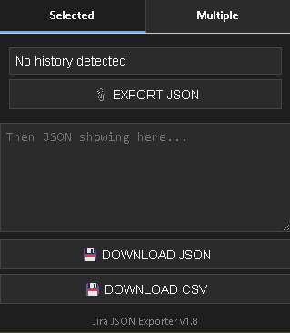
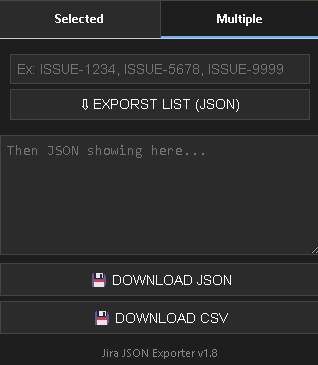

# 📤 Jira JSON Exporter (Chrome Extension)

A minimal and powerful Chrome extension to **export Jira issue data** as JSON or CSV — perfect for backups, reports or integrations.

---

## 🖼️ Interface Overview

This extension has two main modes of operation:

- **History** tab: Automatically detects and exports the currently opened Jira issue.
- **Multiple History** tab: Allows pasting a list of issue keys (e.g. `ISSUE-123`, `ISSUE-456`) to export them all at once.

<table>
<tr>
<td></td>
<td></td>
</tr>
<tr>
<td align="center">🔹 History Tab</td>
<td align="center">🔸 Multiple History Tab</td>
</tr>
</table>

---

## 🚀 Features

- 🔍 Auto-detects current Jira issue from the browser URL
- ⌨️ Paste multiple issue keys to fetch multiple issues
- 🧾 Export as:
  - **Formatted JSON**
  - **Structured CSV** with hierarchy and useful fields
- 🎨 Dark theme UI with clean buttons and indicators

---

## 🛠️ Installation

1. Clone this repository or [Download as ZIP](https://github.com/yourusername/jira-json-exporter/archive/refs/heads/main.zip)
2. Open `chrome://extensions/` in your Chrome browser
3. Enable **Developer mode** (top right)
4. Click **Load unpacked**
5. Select the folder of this extension

---

## 📁 CSV Export Format

The generated CSV includes both parent issues and their subtasks, showing hierarchy clearly:

| Type       | Key      | Summary                | Parent     | Status    | Priority | Reporter     |
|------------|----------|------------------------|------------|-----------|----------|--------------|
| History    | ISSUE-1234 | Update field mappings  |            | Done      | Medium   | michaeldennis  |
| Subtask    | ISSUE-1235 | Create flow            | ISSUE-1234   | In Prog.  | Medium   | robert       |

---

## 📎 Disclaimer

This extension is an **unofficial tool** built to help users export data from Jira that they already have access to while logged into their own instance.

> It is **not affiliated with, endorsed by, or sponsored by Atlassian or Jira** in any way.  
> All trademarks, service marks, and company names are the property of their respective owners.

---

## 🙌 Credits

Created with ❤️ by [Bruno Ribeiro](https://github.com/brunoslribeiro)  

---

## 🧪 License

MIT License
